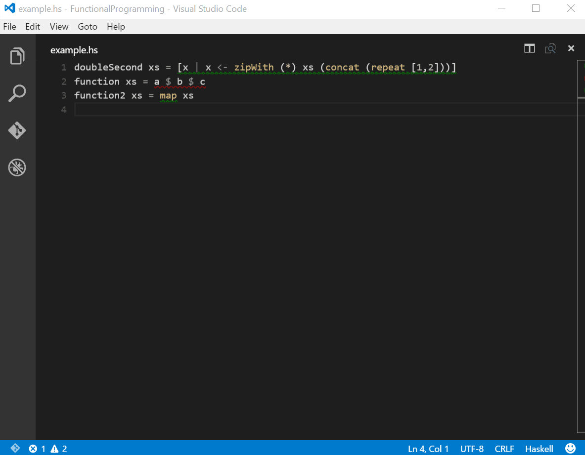

# Hello Extensions!

This post will describe the pieces needed to create a linter extension for Haskell for VS Code. It will build up the pieces one at a time and then connect them all together in the end. If you want to follow along, make sure you have followed the Prerequisites, otherwise skip down to Features.

**Note:** The source for the extension described here can be found in [this repository][5].

## Prerequisites
- [VS Code (>= 0.10.1)][1]
- [Node][2]
- [Hlint][3] (added to your system's $PATH)
- Read the official "Hello World!" [example][4]

Install the yeoman generator for VS Code, run it, and choose `New Extension (TypeScript)` (note: Spaces or special characters in your publisher name will lead to problems with publishing.)
```bash
npm install -g yo generator-code
yo code
```

In the generated `src/` directory create a subdirectory called `features/` with a file called `hlintProvider.ts`.
```bash
mkdir HaskellLinter/src/features
touch HaskellLinter/src/features/hlintProvider.ts
```
Change into the extension directory and launch it with VS Code
```bash
cd HaskellLinter
code .
```

# Adding the Features

This extension will use [hlint][3] to lint our haskell file. The output from hlint will allow us to mark parts of the code with what VS Code calls diagnostics. These provide the squiggly underlines, marks in the gutters, and tooltips on hover. We'll also leverage the suggestions from hlint to provide code actions to refactor our haskell code. These result in the lightbulbs that appear when you select an area that VS Code has underlined.



## Diagnostics + Diagnostic Collection
As described above, Diagnostics provide the underlines in the code. A `Diagnostic` object contains a range comprising the starting and ending line and column, a message, and a severity. To actually make them display, though, a `DiagnosticCollection` is needed.

Using `cp.spawn()`, extensions can call any executable and process the results. The code below uses `cp.spawn()` to call hlint, parses the output into `Diagnostic` objects, and then adds them to a `DiagnosticCollection` with `this.diagnosticCollection.set(textDocument.uri, diagnostics);` which add the chrome in the UI.

Copy the code below into `src/features/hlintProvider.ts`.

```js
// src/features/hlintProvider.ts
'use strict';

import * as path from 'path';
import * as cp from 'child_process';
import ChildProcess = cp.ChildProcess;

import * as vscode from 'vscode';

export default class HaskellLintingProvider {
	
	private diagnosticCollection: vscode.DiagnosticCollection;
	
	private doHlint(textDocument: vscode.TextDocument) {
		if (textDocument.languageId !== 'haskell') {
			return;
		}
		
		let decoded = ''
		let diagnostics: vscode.Diagnostic[] = [];

		let options = vscode.workspace.rootPath ? { cwd: vscode.workspace.rootPath } : undefined;
		let args =  ['--json', textDocument.fileName];
		
		let childProcess = cp.spawn('hlint', ['--json', textDocument.fileName], options);
		if (childProcess.pid) {
			childProcess.stdout.on('data', (data: Buffer) => {
				decoded += data;
			});
			childProcess.stdout.on('end', () => {
				JSON.parse(decoded).forEach( item => {
					let severity = item.severity.toLowerCase() === "warning" ? vscode.DiagnosticSeverity.Warning : vscode.DiagnosticSeverity.Error;
					let message = item.hint + " Replace: " + item.from + " ==> " + item.to;
					let range = new vscode.Range(item.startLine - 1, item.startColumn - 1, 
												 item.endLine - 1, item.endColumn - 1);
					let diagnostic = new vscode.Diagnostic(range, message, severity);
					diagnostics.push(diagnostic);
				});
				this.diagnosticCollection.set(textDocument.uri, diagnostics);
			});
		}
	}
}
```

## Commands and CodeActionProviders
Actions that should appear in the command palette (ctrl+shift+p) are declared in `packages.json` as a `command`. The generated Hello World extension has an example of this. These can then be registered by an extension to trigger any function with the line `vscode.commands.registerCommand('extension.commandId', functionNameOrDefinition)`.

However, for an action that is context specific and shouldn't be in the command palette, don't register it in `packages.json`. But then how will it be triggered? That's where `CodeActionProviders` come in.

A `CodeActionProvider` makes the lightbulb show up in VS Code allowing users to perform refactorings, fix spelling mistakes, etc.

The `CodeActionProvider` interface defines a single method named `provideCodeActions()`. A class that implements this interface and registers with VS Code will have its `provideCodeActions()` method called whenever the user selects text or places the cursor in an area that contains a `Diagnostic`. It is up to the extension, then, to return an array of actions that are applicable for that `Diagnostic`.

The objects returned by `provideCodeActions()` are nothing more than references to a command as discussed above and an array of arguments to pass it. These will display as options if the user clicks the lightbulb. And when the user clicks on the lightbulb? The arguments are passed to whatever function the extension registered for that command as described above.

The code below illustrates how to add code actions to the `HaskellLintingProvider` class shown above. `provideCodeActions()` receives the diagnostics as a member of `CodeActionContext` and returns an array with a single command. `runCodeAction()` is the function that we want to trigger if a user selects our action. Using the arguments passed along with the command it uses a `WorkspaceEdit` to fix a users code according to the suggestions of hlint.

Copy the following code into the body of `HaskellLintingProvider` from `src/features/hlintProvider` after the `doHlint()` function.

```js
// src/features/hlintProvider.ts

	private static commandId: string = 'haskell.hlint.runCodeAction';
	
	public provideCodeActions(document: vscode.TextDocument, range: vscode.Range, context: vscode.CodeActionContext, token: vscode.CancellationToken): vscode.Command[] {
		let diagnostic:vscode.Diagnostic = context.diagnostics[0];
		return [{
			title: "Accept hlint suggestion",
			command: HaskellLintingProvider.commandId,
			arguments: [document, diagnostic.range, diagnostic.message]
		}];
	}
	
	private runCodeAction(document: vscode.TextDocument, range: vscode.Range, message:string): any {
		let fromRegex:RegExp = /.*Replace:(.*)==>.*/g
		let fromMatch:RegExpExecArray = fromRegex.exec(message.replace(/\s/g, ''));
		let from = fromMatch[1];
		let to:string = document.getText(range).replace(/\s/g, '')
		if (from === to) {
			let newText = /.*==>\s(.*)/g.exec(message)[1]
			let edit = new vscode.WorkspaceEdit();
			edit.replace(document.uri, range, newText);
			return vscode.workspace.applyEdit(edit);
		} else {
			vscode.window.showErrorMessage("The suggestion was not applied because it is out of date. You might have tried to apply the same edit twice.");
		}
	}
```

## Wiring it all up
`HaskellLintingProvider` now contains functions that will perform the linting and set the diagnostics, return a list of code actions to make the lightbulb appear, and perform a code action if one is selected. Now it just needs the wiring to make it all work. `activate()` and `dispose()` deal with set-up and tear-down in VS Code extensions. The code below registers the command so that the `CodeActionProvider` can call it and sets up listeners to trigger the linting action.

Again, add the following code to the body of the `HaskellLintingProvider` class from `src/features/hlintProvider.ts`.

```js
// src/features/hlintProvider.ts
	private command: vscode.Disposable;
	
	public activate(subscriptions: vscode.Disposable[]) {
		this.command = vscode.commands.registerCommand(HaskellLintingProvider.commandId, this.runCodeAction, this);
		subscriptions.push(this);
		this.diagnosticCollection = vscode.languages.createDiagnosticCollection();

		vscode.workspace.onDidOpenTextDocument(this.doHlint, this, subscriptions);
		vscode.workspace.onDidCloseTextDocument((textDocument)=> {
			this.diagnosticCollection.delete(textDocument.uri);
		}, null, subscriptions);

		vscode.workspace.onDidSaveTextDocument(this.doHlint, this);

		// Hlint all open haskell documents
		vscode.workspace.textDocuments.forEach(this.doHlint, this);
	}
	
	public dispose(): void {
		this.diagnosticCollection.clear();
		this.diagnosticCollection.dispose();
		this.command.dispose();
	}
```

`HaskellLintingProvider` does the bulk of the work for this extension but it isn't the entry point. The real entry point to our extension is shown below from `src/extension.ts`. When the extension is activated by VS Code it activates its own helper to handle the linting and then registers that helper as a code action provider.

Replace the existing code in `src/extension.ts` with the code below.

```js
// src/extension.ts
import * as vscode from 'vscode'; 

import HaskellLintingProvider from './features/hlintProvider';

export function activate(context: vscode.ExtensionContext) {
	let linter = new HaskellLintingProvider();	
	linter.activate(context.subscriptions);
	vscode.languages.registerCodeActionsProvider('haskell', linter);
}
```

The last piece of the puzzle is declaring the extension in `package.json`. The `main` property declares the entry point of the extension where `activate()` should be called. `package.json` should already contain this line:

```json
	"main": "./out/src/extension",
```
`contributes` can be used to declare commands, but this extension uses it to declare haskell as a language. This is important, because the `activationEvents` property relies on VS Code recognizing haskell files. Replace the properties `activationEvents` and `contributes` in `package.json` with the values below.

```json
// package.json
	"contributes": {
		"languages": [
			{
				"id": "haskell",
				"aliases": ["Haskell", "haskell"],
				"extensions": [".hs",".lhs"]
			}
		]
	},
	"activationEvents": [
		"onLanguage:haskell"
	],
```

# Running the Extension

Everything should be in place to lint Haskell, now. Run the extension by pressing `F5`. VS Code will launch a new window running the extension. Using that new window, create a new file with a `.hs` estension and add the following lines of code:

```haskell
doubleSecond xs = [x | x <- zipWith (*) xs (concat (repeat [1,2]))]
function xs = a $ b $ c
function2 xs = map xs
``` 

After saving the file, each line should be marked with a diagnostic. Press `ctrl+shift+m` to open the error list. Click on an issue to see the code selected. Hover over the selection to see the hlint suggestion. Press `ctrl+.` to activate the lightbulb and press `enter` to accept the suggestion.

Alternatively, simply move the cursor into an underlined piece of code, click the lightbulb that appears, and click "Accept hlint suggestion".

Keep in mind that the linting only occurs on save.

If you have any issues:
- Check that hlint is installed and added to your path
- Reference [this repository][5]
- Use the debugger

# Done!

That's it! I have also released a more sophisticated version of this linter in the [marketplace][6] that allows linting as you type, configuring arguments to pass to the linter, and more. Find the repo for that [here][7].

[1]: https://code.visualstudio.com
[2]: https://nodejs.org/en/download/
[3]: http://community.haskell.org/~ndm/hlint/
[4]: https://code.visualstudio.com/docs/extensions/example-hello-world
[5]: https://github.com/hoovercj/vscode-extension-tutorial
[6]: https://marketplace.visualstudio.com/items/hoovercj.haskell-linter
[7]: https://github.com/hoovercj/vscode-haskell-linter